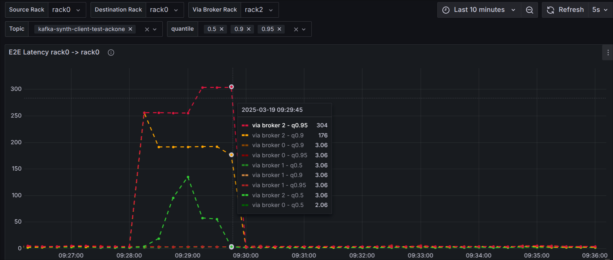
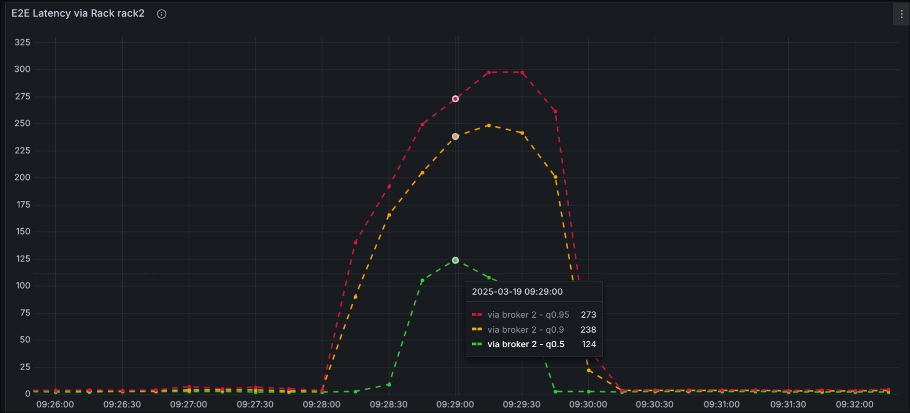
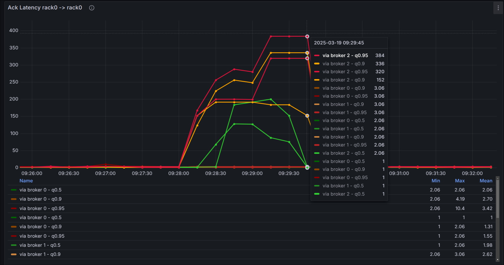

== Dashboards

This repository contains example dashboards you can use to visualize the metrics exposed by the synth client.

On the first panel you can see the e2e latency between producer (source rack) and consumer (destination rack).

As the image shows you can see from the legend or tool tip which path between source and destination rack the message
took and what the latency was.

In this image we see the latencies that were recorded by messages that were passing through any broker in the selected
`via Broker Rack` (in this case `rack2`).

This image shows the ack latency of the messages produced by the synth client. The ack latency is the time it takes
for the broker to acknowledge the message. This is especially interesting if you have configured the producer with
`acks=all` as this will only acknowledge the message once it has been received by all replicas.

If you want to compare the acks settings it's best to deploy 2 sets of synth clients with different acks settings
and a dedicated topic with no replication for `acks=1` setting.
