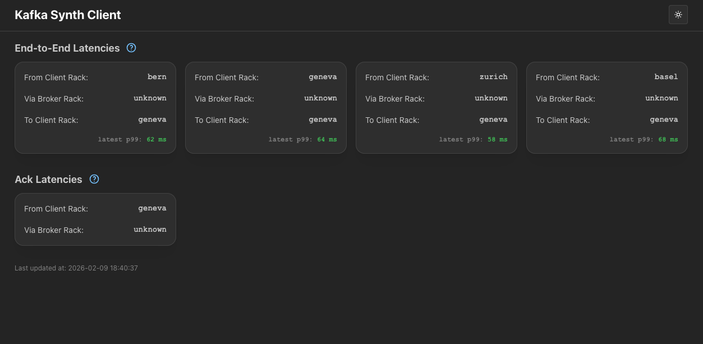
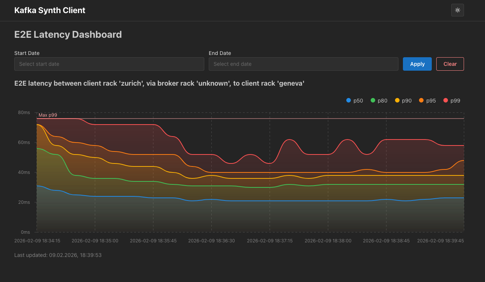

=== Web UI

The Kafka Synth Client includes a built-in web interface that provides real-time visualization of latency metrics and message paths across your Kafka cluster.

.Web UI Message Paths Dashboard


NOTE: Screenshot images are available in PR #72 and need to be added to the repository. See `src/docs/img/README-screenshots.md` for download instructions.

==== Accessing the Web UI

The web UI is available on port `8081` of the synth client deployment (the same port that serves Prometheus metrics). When running with docker-compose, you can access it at:

```
http://localhost:8081
```

When deployed to Kubernetes, the web UI can be exposed through an ingress or service. See the `examples/strimzi.yaml` file for a complete example including ingress configuration.

==== Features

The web UI provides three main dashboards:

===== Message Paths Dashboard

The home dashboard displays all active message paths in your Kafka cluster, showing:

- **End-to-End (E2E) Latency Paths**: Visual representation of message paths from producer rack through broker rack to consumer rack, with current latency measurements
- **Acknowledgement (Ack) Latency Paths**: Direct paths from producer to broker showing acknowledgement latencies

Each path card shows:
- Source and (in the case of E2E-latencies) destination racks
- Broker rack (via rack)
- Current latency in milliseconds
- Interactive hover information

===== E2E Latency Dashboard

Clicking on an E2E latency path takes you to a detailed dashboard showing:

- Historical latency trends over time
- Configurable time ranges (last 5 minutes to 24 hours)
- Interactive charts with hoverable data points
- Multiple percentiles 

.E2E Latency Chart with Time Series Data


===== Ack Latency Dashboard

Clicking on an Ack latency path shows detailed acknowledgement latency metrics:

- Producer to broker acknowledgement times
- Historical trends
- Percentile breakdowns
- Time range selection

==== Multi-DC Setup

When using the `multi-dc-docker-compose.yaml` setup, each synth client instance has its own web UI exposed on different ports:

.Synth Client Ports for ack=all configuration
|===
|Instance |Port (UI & Metrics)

|rack0
|18088

|rack1
|28088

|rack2
|38088
|===

.Synth Client Ports for ack=1 configuration
|===
|Instance |Port (UI & Metrics)

|rack0
|18089

|rack1
|28089

|rack2
|38089
|===

This allows you to view latency data from the perspective of each individual rack or datacenter location.

==== Technology Stack

The web UI is built with:

- React
- Mantine UI components
- React Router for navigation
- Recharts for data visualization
- DayJS for time handling

The UI is served directly by the Quarkus application using Quinoa, which means no separate deployment is needed.
